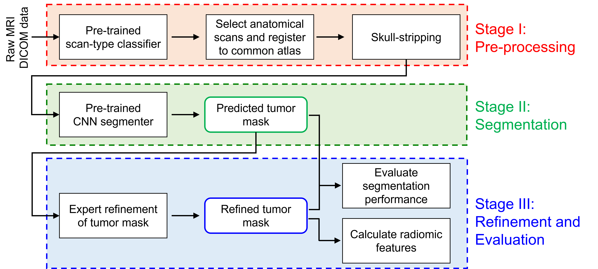

# Integrative Imaging Informatics for Cancer Research: Workflow Automation for Neuro-oncology (I3CR-WANO)
This project aims to offer a completely automated and end-to-end artificial intelligence (AI)-driven workflow for curation and preprocessing of large-scale MRI neuro-oncology studies, with subsequent extraction of quantitative phenotypes.

The workflow i) uses natural language processing and convolutional neural network to classify MRI scans into different anatomical and non-anatomical types; ii) preprocesses the data in a reproducible way; and iii) uses AI to delineate tumor tissue subtypes, enabling extraction of volumetric information along with shape and texture-based radiomic features. Moreover, it is robust to missing MR sequences and adopts an expert-in-the-loop approach, where segmentation results may be manually refined by radiologists.

**Note** that, this is Repository 1/2 of a two-part repository. Repository 2/2 can be found at [NRG_AI_NeuroOnco_segment](https://github.com/satrajitgithub/NRG_AI_NeuroOnco_segment)

This project is created by the Neuroinformatics Research Group ([NRG](https://nrg.wustl.edu/)) at the Computational Imaging Research Center (Washington University School of Medicine).

**Not intended for clinical use.**

## Usage
The workflow can be used either on command-line using [docker](https://www.docker.com/) or using a GUI within [XNAT](https://www.xnat.org/) which is an extensible open-source imaging informatics software platform dedicated to imaging-based research. Both of these running modes require minimal to no setup. Detailed documentations for both can be found at:
1. [running with docker](documentation/running_with_docker.md)
2. [running with XNAT](documentation/running_with_XNAT.md)

For a general overview of each step of the workflow, please refer to our [step-by-step walkthrough](documentation/workflow_step_by_step.md).

## Tutorial videos
Tutorial videos demonstrating the Docker and XNAT usages of I3CR-WANO are available at:

## Demonstration
A live XNAT demonstration of I3CR-WANO can be accessed at: https://demo.xnat.org/ by accessing the `I3CR_WANO_demo` project. The project has containers pulled and command orchestration set up. So, I3CR-WANO can be run in a [single session mode](documentation/running_with_XNAT.md#21-manually-run-multiple-containers-on-single-session), [batch mode](documentation/running_with_XNAT.md#22-manually-run-single-container-on-multiple-sessions-batch-mode), [orchestration mode](documentation/running_with_XNAT.md#23-automatically-run-multiple-containers-on-single-session-command-orchestration), or [batch+orchestration mode](documentation/running_with_XNAT.md#24-automatically-run-multiple-containers-on-multiple-sessions-batch--orchestration).

## Citation
If you use I3CR-WANO in your work, please cite:

_Satrajit Chakrabarty, Syed Amaan Abidi, Mina Mousa, Mahati Mokkarala, Isabelle Hren, Divya Yadav, Matthew Kelsey, Pamela LaMontagne, John Wood, Michael Adams, Yuzhuo Su, Sherry Thorpe, Caroline Chung, Aristeidis Sotiras, Daniel S. Marcus, **"Integrative Imaging Informatics for Cancer Research: Workflow Automation for Neuro-oncology (I3CR-WANO)."** https://arxiv.org/abs/2210.03151 (2022)._

## Contact
Please open a Github issue or send your questions to satrajit.chakrabarty@wustl.edu if you run into any errors.
