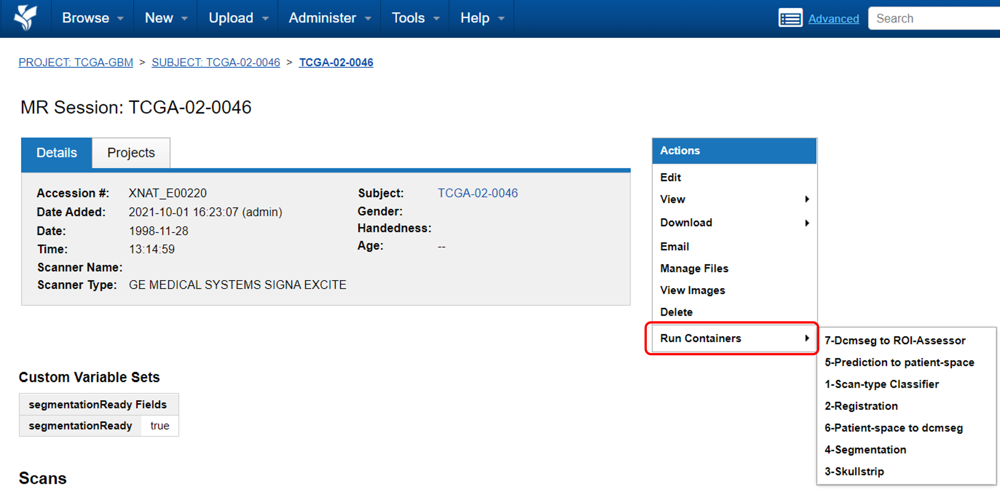
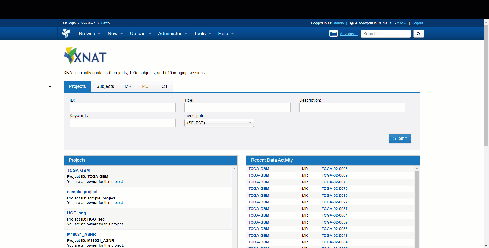

# Running on XNAT
<!-- TOC -->
- [1. Installation and Requirements](#1-installation-and-requirements)
	- [1.1. XNAT setup](#11-xnat-setup)
		- [Latest versions tested](#latest-versions-tested)
	- [1.2. Pulling and enabling containers](#12-pulling-and-enabling-containers)
- [2. Running containers](#2-running-containers)
	- [2.1. Manually run multiple containers on single session](#21-manually-run-multiple-containers-on-single-session)
	- [2.2. Manually run single container on multiple sessions (batch mode)](#22-manually-run-single-container-on-multiple-sessions-batch-mode)
	- [2.3. Automatically run multiple containers on single session (command orchestration)](#23-automatically-run-multiple-containers-on-single-session-command-orchestration)
	- [2.4. Automatically run multiple containers on multiple sessions (batch + orchestration)](#24-automatically-run-multiple-containers-on-multiple-sessions-batch--orchestration)
<!-- /TOC -->

### 1. Installation and Requirements
#### 1.1. XNAT setup
Please follow these steps to set up XNAT, import data, and enable container service:
1. [Set up XNAT](https://wiki.xnat.org/documentation/getting-started-with-xnat/xnat-installation-guide)
2. [Create a project](https://wiki.xnat.org/documentation/how-to-use-xnat/creating-and-managing-projects)
3. [Import data](https://wiki.xnat.org/documentation/how-to-use-xnat/image-session-upload-methods-in-xnat)
4. [Container service administration](https://wiki.xnat.org/container-service/container-service-administration-122978855.html)
##### Latest versions tested  
As of October 2022, this software has been tested on:
* XNAT version 1.8.4.1, build: 7 [[installation guide](https://wiki.xnat.org/documentation/getting-started-with-xnat/xnat-installation-guide)]
* Container Service Plugin 3.1.0 [[link](https://bitbucket.org/xnatdev/container-service/downloads/container-service-3.1.0-fat.jar)]
* Batch Launch Plugin 0.5.0 [[link](https://bitbucket.org/xnatx/xnatx-batch-launch-plugin/downloads/batch-launch-plugin-0.5.0.jar)]
* XNAT OHIF Plugin 3.3.0 [[link](https://bitbucket.org/icrimaginginformatics/ohif-viewer-xnat-plugin/downloads/ohif-viewer-3.3.0.jar)]

#### 1.2. Pulling and enabling containers
Once container service is set up, [pull the following docker images](https://wiki.xnat.org/container-service/pulling-a-container-image-126156950.html) to XNAT:
* `satrajit2012/nrg_ai_neuroonco_preproc:v0`
* `satrajit2012/nrg_ai_neuroonco_segment:v0`

In order to launch containers, the corresponding container commands need to be first enabled at the site level (by a site admin) and then at the project-level (this can be done by a project owner). For details on how to enable commands, please check out the following links:
1. [Enabling commands at site-level](https://wiki.xnat.org/container-service/enabling-commands-and-setting-site-wide-defaults-126156956.html)
2. [Enabling commands at project-level](https://wiki.xnat.org/container-service/enable-a-command-in-your-project-122978909.html)

Now with everything set up, we are ready to run the containers.
### 2. Running containers
There are various ways we can run the containers:
* manually run multiple containers on single session
* manually run single container on multiple sessions (using XNAT's batch-mode feature)
* automatically run multiple containers on single session (using XNAT's command orchestration feature)
* automatically run multiple containers on multiple sessions (by combining XNAT's command orchestration with batch-launch feature)

In this section I describe the above 4 modes of running the containers.
#### 2.1. Manually run multiple containers on single session
In this step, you can launch containers through the "Run Containers" option from the XNAT UI. Note that, as these containers are defined at a session-level context (i.e. they run on each session independently, not on a subject or project level), the "Run Containers" menu should only appear within a session, as following:

Inside the "Run Containers" menu are all the different command wrappers that can be used to launch the different workflows on the session.  
For more details on this, please refer to: [Launching Containers from Commands](https://wiki.xnat.org/container-service/launching-containers-from-commands-122978910.html)

Note that in this step you need to launch each command manually one after other. For example, launch `1-Scan-type Classifier` and wait till its done. Then you can launch `2-Registration` and so on. This can be useful if you need to launch only specific commands of the pipeline on a particular session. However, doing this for every session in a big dataset can be quite tedious. We can address that using XNAT's batch-launch and command orchestration as described later.

#### 2.2. Manually run single container on multiple sessions (batch mode)
In a dataset containing a large number of sessions, it is often necessary to launch a particular command on multiple sessions. This is where [XNAT's Batch Launch Plugin](https://wiki.xnat.org/xnat-tools/batch-launch-plugin) can be particularly useful. Once the Batch Launch Plugin is [installed](https://wiki.xnat.org/xnat-tools/batch-launch-plugin#:~:text=Installing%20the%20Batch%20Launch%20Plugin), you can follow the steps detailed here to bulk-launch a command on session-level: [Using the Batch Launch Plugin with the Container Service](https://wiki.xnat.org/xnat-tools/batch-launch-plugin/using-the-batch-launch-plugin-with-the-container-service).  

Once bulk processing has finished, the Processing Dashboard lists the outcome (Complete/Failed/Ready) as a sortable column which can be used to additionally inspect the results.

#### 2.3. Automatically run multiple containers on single session (command orchestration)
In this step, we will take advantage of XNAT's [Command Orchestration](https://wiki.xnat.org/container-service/set-up-command-orchestration-130515311.html) feature to sequentially run multiple containers on a single-click. In Command orchestration, multiple command wrappers are daisy-chained in a specific sequence by the user so that they run sequentially. For example, we can create an orchestration with `1-Scan-type Classifier`, `2-Registration`, and `3-Skullstrip` as follows:
 
Now when we run this orchestrator on a session, it runs `1-Scan-type Classifier`, `2-Registration`, and `3-Skullstrip` sequentially without requiring the user to wait for each of them to finish and launch the next one. For more details on adding orchestrations to your project and running them, please check out [Add Command Orchestration to Your Project](https://wiki.xnat.org/container-service/add-command-orchestration-to-your-project-132415533.html).  
**Note**: When orchestration is enabled, the first command in the orchestrator will launch the entire orchestration process. For example, if the orchestration contains the following three commands: `1-Scan-type Classifier`, `2-Registration` and `3-Skullstrip`, then upon launching `1-Scan-type Classifier`, the entire orchestration is launched. To address this, we have included a dedicated command called `XNAT orchestrator` with the `satrajit2012/nrg_ai_neuroonco_preproc:v0` container, to be specifically used as the launching command of the orchestration. So, if you want to set up your I3CR-WANO orchestration, please use `XNAT orchestrator` as the first command instead of `1-Scan-type Classifier`.

You can disable command orchestration on a project level by selecting Command Orchestration &#8594; "No orchestration" radio-button (as described [here](https://wiki.xnat.org/container-service/add-command-orchestration-to-your-project-132415533.html#:~:text=To%20remove%20an%20orchestration%20from%20your%20project%2C%20select%20the%20radio%20button%20next%20to%20%22No%20orchestration.%22)). When command orchestration is disabled, `XNAT orchestrator` will not work as expected.

#### 2.4. Automatically run multiple containers on multiple sessions (batch + orchestration)
Finally, by combining XNAT's batch-launch and command orchestration features, we can achieve the highest level of automation in running containers. In this mode, we leverage command orchestration to combine all the desired commands into a single automated flow and batch-launch to bulk-launch the entire flow on multiple user-selected sessions (or all sessions in a project). To achieve this, simply curate the desired orchestration as described in [Section 2.3](#23-automatically-run-multiple-containers-on-single-session) and bulk-launch it as per the instructions in [Section 2.2](#22-manually-run-single-container-on-multiple-sessions).
