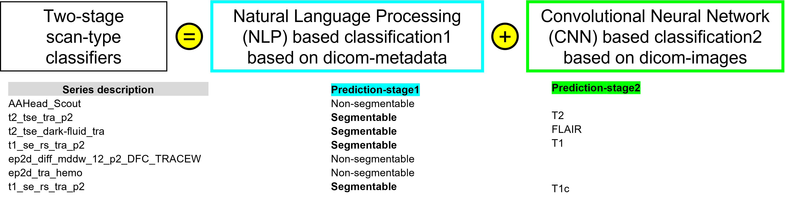

# Step-by-step walkthrough of framework
All details of individual steps can be found in the [main paper](https://arxiv.org/pdf/2210.03151.pdf).
The entire framework consists of 7 steps:
<!-- TOC -->

- [1. Scan-type classifier](#1-scan-type-classifier)
  - [Rule-based selection](#rule-based-selection)
- [2. Image registration](#2-image-registration)
- [3. Skull stripping and N4 bias correction](#3-skull-stripping-and-n4-bias-correction)
- [4. Segmentation and extraction of radiomic features](#4-segmentation-and-extraction-of-radiomic-features)
  - [Our segmentation workflow is robust to missing MR sequences](#our-segmentation-workflow-is-robust-to-missing-mr-sequences)
  - [Extraction of radiomic features](#extraction-of-radiomic-features)
- [5. Converting segmentation from atlas-space &#8594; patient-space](#5-converting-segmentation-from-atlas-space-8594-patient-space)
- [6. Converting patient-space segmentation from nifti &#8594; dicom-seg format](#6-converting-patient-space-segmentation-from-nifti-8594-dicom-seg-format)
- [7. Uploading dicom-seg segmentation as ROI-assessor (XNAT specific)](#7-uploading-dicom-seg-segmentation-as-roi-assessor-xnat-specific)

<!-- /TOC -->

## 1. Scan-type classifier
This step consists of a two-stage classifier:
1. a Natural Language Processing (NLP) based [classifier](https://doi.org/10.1117/12.2548371) based on dicom-metadata (`Classifier1`)
2. a Convolutional Neural Network (CNN) based [classifier](https://link.springer.com/article/10.1007/s12021-020-09475-7) based on dicom image (`Classifier2`)

In the first stage, `Classifier1` takes as input the dicom series description (dicom tag) and number of frames (dicom tag) and classifies scans into two classes - segmentable or non-segmentable. In the second stage `Classifier2` takes only the segmentable scans and performs a more granular classification into - pre-contrast T1-weighted, post-contrast T1-weighted, T2-weighted, and T2-weighted Fluid Attenuation Inversion Recovery sequences.

### Rule-based selection
If a session contains only one of each T1w, T1c, T2 and Flair sequences, then these 4 scans are automatically selected for the downstream processing. However, to address situations when there are multiple scans of one of more of these sequences, a rule-based selection heuristic is implemented in the code which automatically selects the required sequences.

## 2. Image registration
In this step, for every session, the sequences selected from [scan-type classification](#rule-based-selection) are first rigidly co-registered to the T1w scan (or T1c scan in absence of T1w) followed by a rigid registration to a common anatomical atlas. For this step we have used the FMRIB's Linear Image Registration Tool ([FLIRT](https://fsl.fmrib.ox.ac.uk/fsl/fslwiki/FLIRT)).
## 3. Skull stripping and N4 bias correction
In this step, we take as input the registered sequences from [registration](#2-image-registration) and perform N4 bias field correction followed by extraction of brain mask. For this step, we have used the Robust Brain Extraction ([ROBEX](https://www.nitrc.org/projects/robex)) tool.

## 4. Segmentation and extraction of radiomic features
In this stage, we use a CNN based model for segmentation of gliomas. If all 4 MR sequences (T1w, T1c, T2, Flair) are available, then the model produces a 3-class segmentation of gliomas comprising the non-enhancing/necrotic core, enhancing tumor and edema. We have pre-trained our model on 1251 glioma cases available from the BraTS 2021 challenge.
### Our segmentation workflow is robust to missing MR sequences
Conventional CNNs are limited by their input requirements - for example, in the context of tumor segmentation, if a CNN needs T1, T1c, T2, and Flair sequences to produce segmentation, it cannot be used on patient cases where even any one of those sequences are missing. However, in a clinical setting, we often have missing sequences. To address this, we have trained multiple versions of our model on different subsets of sequences – T1c+T2, T2+FLAIR, T1c+FLAIR, only T1c etc. Based on the availability of sequences, the model produces the following segmentations:

| available sequence                               | granularity of segmentation                |
|--------------------------------------------------|--------------------------------------------|
| if atleast T1c available                         | non-enhancing/necrotic + enhancing + edema |
| if T1c not available but atleast T2 available    | whole tumor*                                |
| if T1c not available but atleast Flair available | whole tumor*                                |
| T1c/T2/Flair not available, only T1 available    | no segmentation                            |

*whole tumor = non-enhancing/necrotic, enhancing, and edema merged into a single binary mask

### Extraction of radiomic features
We use [Pyradiomics](https://pyradiomics.readthedocs.io/en/latest/) to calculate radiomic features. All features included in pyradiomics suite are calculated including:
1. First Order Statistics
2. Shape-based (2D + 3D)
3. Texture based features - GLCM, GLSZM, GLRLM, NGTDM, GLDM

We calculate the features at every level of granularity, i.e.,
- for each tumor sub-compartment (non-enhancing/necrotic, enhancing, edema, tumor core, whole tumor)
- for each input sequence (all features except shape-features)

## 5. Converting segmentation from atlas-space &#8594; patient-space
Once the segmentation mask is created, we register the mask back to patient-space using the [FSL FLIRT](https://fsl.fmrib.ox.ac.uk/fsl/fslwiki/FLIRT) command.
## 6. Converting patient-space segmentation from nifti &#8594; dicom-seg format
We take the nifti tumor mask (patient-space) created in the previous step and convert the nifti mask to dicom-seg format. For this, we have used the `itkimage2segimage` command from the [dcmqi](https://github.com/QIICR/dcmqi) tool.
## 7. Uploading dicom-seg segmentation as ROI-assessor (XNAT specific)
Note that, this final step is only applicable for XNAT. In this step, we take the tumor segmentation mask (patient-space and in dicom-seg format) and upload it as XNAT's "ROI Collection" datatype. This enables the user to visualize the segmentation on the XNAT OHIF viewer. OHIF (Open Health Imaging Foundation) is a Javascript-based image viewer integrated into XNAT ([paper](https://www.mdpi.com/2379-139X/8/1/40)) which provides a powerful set of image annotation tools to XNAT users, including the ability to manually refine the annotations, perform measurements, and save those contours and segmentations as "ROI Collection" objects back into XNAT. For more details on using the XNAT OHIF viewer, please refer to the following link: [Using the XNAT OHIF Viewer](https://wiki.xnat.org/documentation/xnat-ohif-viewer/using-the-xnat-ohif-viewer-122978515.html).

